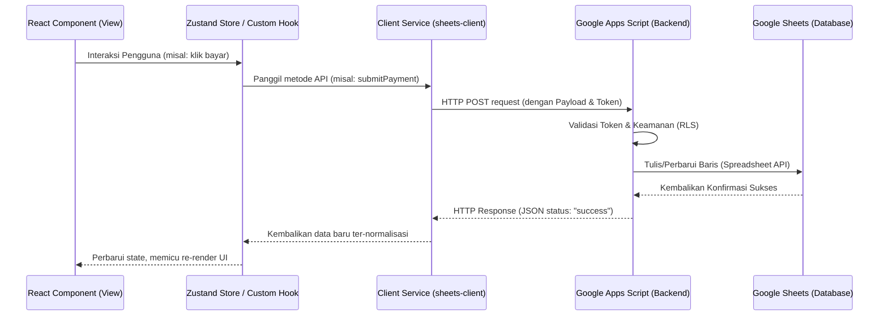

# Architecture Guide (Soematra Kost Architecture)

Dokumen ini menjelaskan desain arsitektur aplikasi **Soematra Kost**, termasuk arsitektur *frontend*, struktur folder, aliran data (*data flow*), sistem *routing*, manajemen *state*, layer *service*, serta detail integrasi dengan Google Sheets dan Google Apps Script.

---

## 1. Arsitektur Frontend

Aplikasi Soematra Kost dibangun sebagai **Single Page Application (SPA)** berbasis teknologi web modern:
* **React 19:** Framework UI utama untuk deklarasi komponen dan manajemen siklus hidup visual.
* **Vite 8:** *Build tool* dan *bundler* super cepat untuk proses pengembangan dan kompilasi produksi.
* **TypeScript:** Memberikan pengetikan statis yang kuat untuk meningkatkan keandalan kode terutama pada logika perhitungan keuangan kos.
* **Tailwind CSS & Vanilla CSS:** Framework CSS utilitas untuk styling yang fleksibel, cepat, dan responsif.
* **Zustand:** Pustaka manajemen *state* global yang ringan untuk mengelola UI *state* (seperti sidebar) dan status autentikasi.

---

## 2. Struktur Folder Target

Aplikasi ini menggunakan pola **Feature-Based Architecture**. Komponen, halaman, *hooks*, dan *service* yang terkait langsung dengan suatu domain bisnis dikelompokkan bersama di bawah folder fitur tersebut. 

Berikut adalah gambaran struktur folder saat ini:

* 📂 **[src/app/](file:///d:/Soematra%20Kost/src/app)** — Berisi entry point aplikasi, gaya global, dan setup routing.
  * `App.tsx` (routing utama)
  * `App.css` (styling dasar)
* 📂 **[src/components/](file:///d:/Soematra%20Kost/src/components)** — Komponen bersama yang digunakan lintas fitur.
  * `ui/` (Komponen UI atomik seperti tombol, dialog konfirmasi, tabel, input loader)
  * `layout/` (Tata letak utama dashboard, sidebar, dan header)
  * `common/` (Komponen utilitas umum seperti `ErrorBoundary.tsx`)
* 📂 **[src/config/](file:///d:/Soematra%20Kost/src/config)** — Konfigurasi global sistem.
* 📂 **[src/features/](file:///d:/Soematra%20Kost/src/features)** — Folder utama pembagian domain bisnis.
  * `auth/` (Login, logout, visual state, dan `ProtectedRoute`)
  * `dashboard/` (Halaman dashboard utama per peran)
  * `residents/` (Pengelolaan data warga, kamar, dan piket bersama)
  * `billing/` (Pembuatan tagihan dan visualisasi iuran bulanan)
  * `payments/` (Konfirmasi bukti transfer warga dan validasi bendahara)
  * `gallon-tracker/` (Pelacakan konsumsi galon, stok, dan vendor)
  * `accounting/` (Pembukuan jurnal umum, buku besar, neraca saldo, dan penutupan buku)
  * `reports/` (Laporan kas dan arus keuangan kos)
  * `notifications/` (Pengumuman dan pemberitahuan sistem)
  * `settings/` (Pengaturan global aplikasi, backup/restore, dan profil akun)
* 📂 **[src/services/](file:///d:/Soematra%20Kost/src/services)** — Klien API global (`sheets-client.ts` untuk komunikasi Sheets).
* 📂 **[src/stores/](file:///d:/Soematra%20Kost/src/stores)** — Manajemen *state* Zustand global non-fitur (seperti `sidebar-store.ts`).
* 📂 **[src/types/](file:///d:/Soematra%20Kost/src/types)** — Definisi tipe TypeScript global.
* 📂 **[src/utils/](file:///d:/Soematra%20Kost/src/utils)** — Utilitas umum seperti enkripsi, ID generik, dan pembantu kelas CSS.

---

## 3. Aliran Data (Data Flow)

Aliran data dalam aplikasi bersifat satu arah (*unidirectional data flow*) dengan pola interaksi sebagai berikut:

---

## 4. Routing & Otorisasi Peran

Sistem routing dideklarasikan menggunakan `react-router-dom` di dalam [App.tsx](file:///d:/Soematra%20Kost/src/app/App.tsx). Otorisasi akses halaman diamankan dengan komponen pembungkus [ProtectedRoute.tsx](file:///d:/Soematra%20Kost/src/features/auth/components/ProtectedRoute.tsx):

* **Rute Publik:** `/login` dibungkus dengan `AuthLayout` untuk pengguna yang belum terotentikasi.
* **Rute Terproteksi Bersama:** `/dashboard`, `/dashboard/profile`, `/dashboard/information` dapat diakses oleh semua peran pengguna terotentikasi (`super admin`, `admin`, `user`).
* **Rute Terproteksi Khusus Staff:** `/dashboard/billing`, `/dashboard/finance`, `/dashboard/gallons-management`, `/dashboard/duties` hanya diperbolehkan untuk peran `super admin` dan `admin` (Bendahara).
* **Rute Terproteksi Khusus Super Admin:** Modul sensitif seperti `/dashboard/warga` (Manajemen Warga), `/dashboard/roles`, `/dashboard/master` (Bagan Akun), `/dashboard/audit` (Audit Logs), `/dashboard/backup` (Restore Data), dan `/dashboard/settings` dikunci khusus untuk peran `super admin` (Pemilik Kos).

---

## 5. Manajemen State & Sesi

Manajemen *state* global diimplementasikan dengan **Zustand**:

1. **Autentikasi & Sesi ([useAuth.ts](file:///d:/Soematra%20Kost/src/features/auth/hooks/useAuth.ts)):**
   * Menyimpan profil pengguna aktif (`profile`) dan peran aktif (`activeRole`).
   * Mengamankan data sesi di `localStorage` dengan tanda tangan lokal (signature) menggunakan kunci enkripsi dari `.env.local` (`VITE_SESSION_SIGNATURE_SECRET`) atau UUID dinamis per tab sesi untuk menghindari pembajakan peran secara lokal (*tampering*).
   * Mendukung penyamaran peran (*role impersonation*) bagi Super Admin untuk pengujian visual tanpa kehilangan hak akses otentikasi API yang sebenarnya di backend.

2. **Tata Letak UI ([sidebar-store.ts](file:///d:/Soematra%20Kost/src/stores/sidebar-store.ts)):**
   * Mengontrol apakah sidebar dalam kondisi terlipat (*collapsed*) atau terbuka lebar (*expanded*).
   * Menyimpan preferensi status lipatan di `localStorage` agar konsisten saat halaman dimuat ulang.

---

## 6. Layer Service & Sanitasi Data

Seluruh komunikasi HTTP ke backend dipusatkan pada berkas [sheets-client.ts](file:///d:/Soematra%20Kost/src/services/sheets-client.ts):

* **Penambahan Parameter Keamanan:** Setiap request POST/GET menyertakan token API (`VITE_SOEMATRA_API_TOKEN`) dan data sesi aktif (`userEmail`, `userRole`) untuk memfasilitasi Row-Level Security (RLS) di sisi server Apps Script.
* **Sanitasi Data Mentah:** Data tabular dari baris Google Sheets dikembalikan oleh Apps Script dalam format array. Layer service melakukan transformasi tipe data (misalnya, mengonversi string numerik menjadi bertipe `number` riil, dan string tanggal menjadi tipe data tanggal JavaScript terformat) sebelum data dilempar ke komponen visual. Hal ini penting untuk memastikan Vitest unit testing berjalan konsisten dan tidak terjadi kesalahan perhitungan nominal pada modul akuntansi IFRS.

---

## 7. Integrasi Google Sheets & Google Apps Script

* **Database Tanpa Server:** Google Sheets berfungsi sebagai tempat penyimpanan data fisik utama. Setiap tabel direpresentasikan oleh satu tab/lembar kerja khusus (seperti tab `Users`, `Bills`, `Payments`).
* **Apps Script API Engine:** Berkas `soematra-sheets-api.gs` dideploy sebagai Web App di Google Apps Script. Script ini bertindak sebagai API gateway yang mengubah permintaan HTTP GET/POST menjadi operasi baca-tulis seluler menggunakan library bawaan Google (`SpreadsheetApp`).
* **Row-Level Security (RLS) & Server-Side Guard:** Apps Script membatasi pengembalian baris data. Jika pemanggil adalah `user`, baris tagihan atau pembayaran yang dikirimkan ke frontend akan difilter ketat hanya untuk milik email pemanggil yang bersangkutan.

---

## 8. Arsitektur Deployment

1. **Frontend (Client):** Dikompilasi menjadi berkas statis teroptimasi (`/dist`) menggunakan perintah `npm run build` dan dideploy pada layanan hosting statis modern seperti **Vercel** atau **Netlify**. Seluruh perutean (*routing*) dialihkan ke `index.html` (SPA Fallback Redirect).
2. **Backend (Database & API):** Dijalankan sepenuhnya pada infrastruktur komputasi awan Google (Google Cloud & Google Drive) melalui **Google Apps Script** dan **Google Spreadsheet** yang gratis, tanpa memerlukan pengelolaan server fisik.
