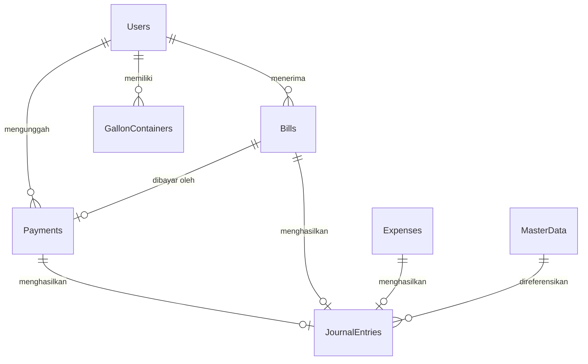

# Data and Integration Guide (Spreadsheet & Apps Script API)

Dokumen ini menjelaskan rancangan basis data berbasis Google Spreadsheet, kamus data kolom lembar kerja (sheets), aksi integrasi API (GET, POST, PUT, DELETE), serta format request/response yang dijembatani oleh Google Apps Script backend.

---

## 1. Kamus Data Kolom (Data Dictionary)

Berikut adalah lembar kerja (sheets) yang berfungsi sebagai tabel basis data aplikasi Soematra Kost:

### 1.1 `Users` (Data Profil & Peran)
Menyimpan profil penghuni kos, admin, dan super admin.
* **id** (`string`, PK): UUID aman buatan client (contoh: `USR-xxxx`).
* **full_name** (`string`): Nama lengkap warga.
* **nickname** (`string`, opsional): Nama panggilan untuk visual.
* **email** (`string`, unik): Alamat email (digunakan untuk login).
* **role** (`string`): Hak otorisasi (`super admin` | `admin` | `user`).
* **room_number** (`string`): Nomor kamar kos (kosong jika staf kos/admin).
* **status** (`string`): Status keaktifan (`Aktif` | `Nonaktif`).
* **password** (`string`): Hash SHA-256 dari kata sandi.

### 1.2 `Bills` (Tagihan Iuran Warga)
Menyimpan daftar tagihan berkala untuk setiap kamar kos.
* **id** (`string`, PK): UUID tagihan (contoh: `BIL-xxxx`).
* **amount** (`number`): Nominal rupiah tagihan.
* **status** (`string`): Status pembayaran (`unpaid` | `pending` | `paid` | `rejected`).
* **due_date** (`string`): Tanggal jatuh tempo (format `YYYY-MM-DD`).
* **resident_email** (`string`, FK): Menghubungkan ke `Users.email`.
* **resident_name** (`string`): Nama lengkap warga pembayar.
* **room_number** (`string`): Nomor kamar kos pembayar.
* **contributions** (`string`): JSON string berisi data template iuran terkait (`{ "title": "...", "contribution_types": { "name": "..." } }`).

### 1.3 `Payments` (Unggah Bukti Bayar)
Menyimpan konfirmasi pembayaran iuran yang diajukan oleh warga.
* **id** (`string`, PK): UUID transaksi pembayaran (contoh: `PAY-xxxx`).
* **billId** (`string`, FK): Menghubungkan ke `Bills.id`.
* **amount** (`number`): Nominal transfer aktual.
* **status** (`string`): Status verifikasi (`pending_verification` | `verified` | `rejected`).
* **date** (`string`): Tanggal pembayaran dari warga (`YYYY-MM-DD`).
* **date_submitted** (`string`): Timestamp ISO pengajuan data.
* **resident_email** (`string`, FK): Menghubungkan ke `Users.email`.
* **resident_name** (`string`): Nama pengirim konfirmasi.
* **room_number** (`string`, opsional): Nomor kamar pembayar.
* **proofDataUrl** (`string`, opsional): Data URL base64 atau tautan eksternal berkas bukti transfer gambar.
* **proofFileName** (`string`, opsional): Nama berkas bukti bayar gambar.

### 1.4 `Expenses` (Pengeluaran Kas Kos)
Mencatat seluruh beban pengeluaran operasional kos.
* **id** (`string`, PK): UUID pengeluaran (contoh: `EXP-xxxx`).
* **amount** (`number`): Nominal pengeluaran rupiah.
* **category** (`string`): Kategori beban (misal: `Air & Galon`, `Listrik`, dsb.).
* **date** (`string`): Tanggal pengeluaran (`YYYY-MM-DD`).
* **title** (`string`, opsional): Judul transaksi.
* **note** (`string`, opsional): Catatan detail pengeluaran.
* **created_at** (`string`): Timestamp ISO pembuatan catatan.

### 1.5 `JournalEntries` (Pembukuan Akuntansi Ganda)
Menyimpan entri jurnal akuntansi berpasangan (Double Entry).
* **id** (`string`, PK): ID jurnal transaksi (contoh: `JE-xxxx`, `BIL-xxxx` untuk piutang, `CL-xxxx` untuk penutupan buku).
* **date** (`string`): Tanggal posting jurnal (`YYYY-MM-DD`).
* **description** (`string`): Penjelasan ringkas jurnal.
* **debits** (`string`): Array JSON baris debit (`[{"accountNumber":"xxxx","amount":xxxx}]`).
* **credits** (`string`): Array JSON baris kredit (`[{"accountNumber":"xxxx","amount":xxxx}]`).
* **source** (`string`): Sumber transaksi (`billing_invoice` | `payment_verification` | `expense_recording` | `closing_process` | `manual`).
* **source_id** (`string`): ID entitas pemicu (contoh: `PAY-xxxx`, `BIL-xxxx`, `EXP-xxxx`).
* **created_at** (`string`): Timestamp ISO pembuatan.

### 1.6 `MasterData` (Bagan Akun / COA)
Menyimpan daftar Chart of Accounts (COA) resmi akuntansi kos.
* **id** (`string`, PK): Nomor Akun Akuntansi (contoh: `1102`, `5106`).
* **account_number** (`string`): Nomor Akun (misal: `1102`).
* **account_name** (`string`): Nama Akun (misal: `Kas Bank BCA`).
* **account_type** (`string`): Klasifikasi (`Harta` | `Kewajiban` | `Modal` | `Pendapatan` | `Beban`).
* **status** (`string`): Status keaktifan (`Aktif` | `Nonaktif`).

---

## 2. Hubungan Antar Data (Relational ERD)



---

## 3. Protokol Integrasi API Google Apps Script

Aplikasi frontend berinteraksi dengan API Google Apps Script melalui protokol HTTP JSON.

### 3.1 Operasi GET (Mengambil Data)
* **Endpoint:** `${VITE_SPREADSHEET_API_URL}?action=get&sheet=${sheetName}`
* **Headers:** `'X-Soematra-Token'` (Token Keamanan).
* **Query Parameters:** `userEmail` & `userRole` (Digunakan server untuk menerapkan RLS).
* **Response Format:**
  ```json
  {
    "status": "success",
    "data": [
      {
        "id": "BIL-001",
        "amount": 25000,
        "status": "unpaid"
      }
    ]
  }
  ```

### 3.2 Operasi POST (Menambah Data)
* **Method:** `POST`
* **Body Format:**
  ```json
  {
    "action": "post",
    "sheet": "Payments",
    "token": "SOEMATRA_SECURE_TOKEN",
    "userEmail": "user@email.com",
    "userRole": "user",
    "data": {
      "billId": "BIL-001",
      "amount": 25000,
      "proofFileName": "bukti.png"
    }
  }
  ```

### 3.3 Operasi PUT (Mengubah Data)
* **Method:** `POST` (GAS disimulasikan menggunakan POST untuk meminimalkan preflight CORS).
* **Payload Aksi:** `"action": "put"` di dalam JSON body untuk memperbarui baris berdasarkan kecocokan ID.

---

## 4. Keamanan & Integritas Data

1. **Row-Level Security (RLS) Enforcement:** Backend secara ketat memotong baris data pada sheet `Bills` dan `Payments` berdasarkan email pemanggil jika perannya adalah `user`. Data penghuni lain tidak akan dikirimkan ke client browser.
2. **Double-Entry Verification:** Server Apps Script dan frontend menuntut agar entri debit dan kredit pada entri jurnal akuntansi selalu seimbang (*balanced*) sebelum dituliskan ke sheet `JournalEntries`.
3. **Pemberian ID Unik di Client:** Setiap pembuatan entri baru menyertakan UUID yang dibuat secara acak di sisi client menggunakan utilitas `generateSecureId` (menggunakan `crypto.getRandomValues`).
