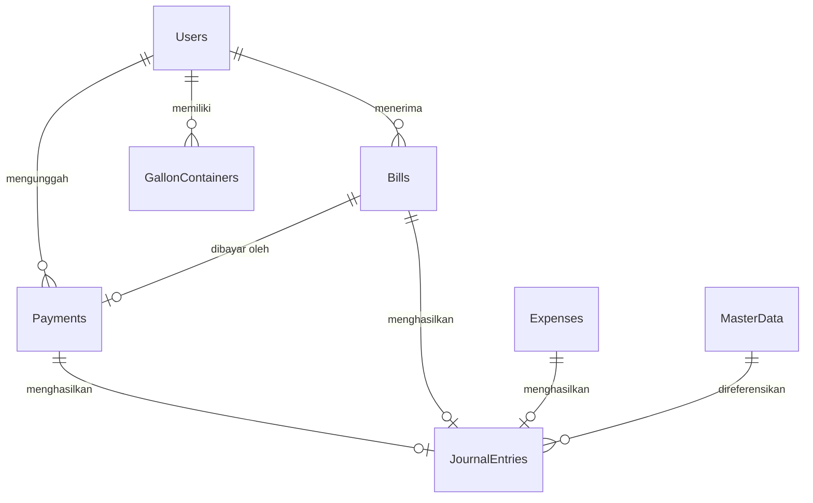

# Dokumentasi Schema Database – Google Sheets

Dokumen ini menjelaskan struktur data, kolom, tipe data, serta relasi antar lembar kerja (sheets) pada Google Spreadsheet yang digunakan sebagai basis data aplikasi Soematra Kost.

---

## 1. Tabel Utama & Spesifikasi Kolom

### 1.1 `Users` (Data Pengguna & Warga)
Menyimpan profil penghuni kos, admin, dan super admin.
* **id** (`string`, PK): UUID yang dibuat secara secure (contoh: `USR-xxxx`).
* **full_name** (`string`): Nama lengkap warga.
* **nickname** (`string`, opsional): Nama panggilan untuk tampilan.
* **email** (`string`, unik): Alamat email (digunakan untuk login).
* **role** (`string`): Hak akses (`super admin` | `admin` | `user`).
* **room_number** (`string`): Nomor kamar kos yang dihuni (kosong jika admin/pemilik).
* **status** (`string`): Status keaktifan (`Aktif` | `Nonaktif`).
* **password** (`string`): Hash SHA-256 dari sandi akun.

### 1.2 `Bills` (Tagihan Warga)
Menyimpan tagihan iuran berkala (sewa, galon kustom, dll.) untuk setiap warga.
* **id** (`string`, PK): UUID tagihan (contoh: `BIL-xxxx`).
* **amount** (`number`): Nominal rupiah tagihan.
* **status** (`string`): Status pembayaran (`unpaid` | `pending` | `paid` | `rejected`).
* **due_date** (`string`): Tanggal jatuh tempo format YYYY-MM-DD.
* **resident_email** (`string`, FK): Menghubungkan ke `Users.email`.
* **resident_name** (`string`): Nama lengkap warga pembayar.
* **room_number** (`string`): Nomor kamar pembayar.
* **contributions** (`string`): Representasi JSON data template iuran terkait (`{ "title": "...", "contribution_types": { "name": "..." } }`).

### 1.3 `Payments` (Konfirmasi Pembayaran & Bukti Transfer)
Menyimpan mutasi pembayaran iuran yang diunggah oleh warga dan menunggu verifikasi admin.
* **id** (`string`, PK): UUID bukti transaksi (contoh: `PAY-xxxx`).
* **billId** (`string`, FK): Menghubungkan ke `Bills.id`.
* **amount** (`number`): Nominal pembayaran.
* **status** (`string`): Status verifikasi (`pending_verification` | `verified` | `rejected`).
* **date** (`string`): Tanggal transaksi transfer format YYYY-MM-DD.
* **date_submitted** (`string`): Waktu ISO data di-submit oleh warga.
* **resident_email** (`string`, FK): Menghubungkan ke `Users.email`.
* **resident_name** (`string`): Nama warga pengunggah.
* **room_number** (`string`, opsional): Nomor kamar pembayar.
* **proofDataUrl** (`string`, opsional): Data URL base64/URL eksternal dari gambar bukti transfer.
* **proofFileName** (`string`, opsional): Nama berkas gambar bukti bayar.

### 1.4 `Expenses` (Biaya & Pengeluaran Kas)
Menyimpan catatan pengeluaran kas kos (biaya pemeliharaan, pembelian galon, listrik, internet, dsb.).
* **id** (`string`, PK): UUID transaksi beban (contoh: `EXP-xxxx`).
* **amount** (`number`): Nominal pengeluaran.
* **category** (`string`): Kategori pengeluaran (berelasi ke MasterData COA, contoh: `Air & Galon`, `Listrik`, `Kebersihan`, `Perbaikan`, `Lainnya`).
* **date** (`string`): Tanggal beban dicatat format YYYY-MM-DD.
* **title** (`string`, opsional): Judul pengeluaran.
* **note** (`string`, opsional): Keterangan rinci.
* **created_at** (`string`): Timestamp ISO pembuatan.

### 1.5 `JournalEntries` (Jurnal Akuntansi Ganda)
Menyimpan seluruh catatan double-entry untuk transaksi keuangan otomatis/manual.
* **id** (`string`, PK): ID jurnal transaksi (contoh: `JE-xxxx`, `BIL-xxxx` untuk piutang tagihan, `CL-xxxx` untuk tutup buku).
* **date** (`string`): Tanggal posting YYYY-MM-DD.
* **description** (`string`): Penjelasan transaksi.
* **debits** (`string`): Array JSON dari baris debit (`[{"accountNumber":"xxxx","amount":xxxx}]`).
* **credits** (`string`): Array JSON dari baris kredit (`[{"accountNumber":"xxxx","amount":xxxx}]`).
* **source** (`string`): Sumber pemicu (`billing_invoice` | `payment_verification` | `expense_recording` | `closing_process` | `manual`).
* **source_id** (`string`): ID entitas pemicu (contoh: `PAY-xxxx`, `BIL-xxxx`, `EXP-xxxx`).
* **created_at** (`string`): Timestamp ISO pembuatan.

### 1.6 `MasterData` (Chart of Accounts & Bagan Akun)
Menyimpan daftar Chart of Accounts (COA) resmi yang menjadi referensi entri jurnal.
* **id** (`string`, PK): Nomor/Kode Akun Akuntansi (contoh: `1102`, `5106`).
* **account_number** (`string`): Nomor Akun (misal: `1102`).
* **account_name** (`string`): Nama Akun (misal: `Kas BCA`).
* **account_type** (`string`): Klasifikasi (`Aset` | `Kewajiban` | `Ekuitas` | `Pendapatan` | `Beban`).
* **status** (`string`): Status keaktifan (`Aktif` | `Nonaktif`).

### 1.7 `Gallons` (Riwayat Transaksi Stok Galon)
Menyimpan riwayat penggunaan dan pembelian galon kos.
* **id** (`string`, PK): UUID transaksi galon (contoh: `G-xxxx`).
* **quantity** (`number`): Jumlah galon yang berkurang/bertambah (skala konversi liter).
* **type** (`string`): Tipe transaksi (`Penggunaan` | `Pembelian`).
* **date** (`string`): Tanggal format YYYY-MM-DD.
* **userName** (`string`): Nama warga yang memakai atau admin penginput.
* **note** (`string`, opsional): Keterangan detail.
* **containerName** (`string`, opsional): Nama botol/wadah yang digunakan.
* **containerType** (`string`, opsional): Jenis wadah (`Tumbler` | `Gelas`).
* **containerCapacity** (`number`, opsional): Kapasitas liter wadah.
* **photoUrl** (`string`, opsional): Tautan foto botol (untuk auto-recognition nanti).
* **created_at** (`string`): Timestamp ISO.

### 1.8 `GallonContainers` (Wadah Galon Warga)
Menyimpan daftar botol/wadah yang didaftarkan oleh warga untuk konversi otomatis ke volume galon.
* **id** (`string`, PK): UUID wadah (contoh: `GC-xxxx`).
* **name** (`string`): Nama wadah (contoh: `Tumbler Biru Alfi`).
* **type** (`string`): Jenis (`Tumbler` | `Gelas` | `Botol` | `Lainnya`).
* **capacity** (`number`): Kapasitas wadah dalam Liter.
* **photoUrl** (`string`, opsional): Tautan foto wadah.
* **createdBy** (`string`, FK): Menghubungkan ke `Users.id`.

### 1.9 `Schedules` / `DutySchedules` (Jadwal Piket Warga)
Menyimpan antrean jadwal piket ganti galon & buang sampah.
* **id** (`string`, PK): UUID jadwal (contoh: `DS-xxxx`).
* **date** (`string`): Tanggal tugas/Nomor Antrean tugas.
* **task** (`string`): Deskripsi tugas piket.
* **user** (`string`): Petugas yang ditunjuk (nama panggilan & nomor kamar).
* **user_id** (`string`): ID rujukan warga atau `'Grup'` untuk tugas bersama.
* **status** (`string`): Status penyelesaian (`Menunggu` | `Selesai`).
* **created_at** (`string`): Timestamp ISO pembuatan.

### 1.10 `Settings` (Pengaturan Sistem)
Menyimpan konfigurasi parameter sistem kos.
* **id** (`string`, PK): UUID setting.
* **defaultBillingDueDay** / **billingDueDay** (`number`): Tanggal default jatuh tempo tagihan kos bulanan (default: `12`).

### 1.11 `AuditLogs` (Log Aktivitas Mutasi Data)
Menyimpan rekam jejak operasi sensitif yang dikerjakan pengguna di sistem.
* **id** (`string`, PK): UUID log.
* **timestamp** (`string`): Tanggal & waktu ISO kejadian.
* **user** (`string`): Alamat email/nama pelaku aksi.
* **action** (`string`): Operasi yang dilakukan (`LOGIN` | `POST_BILL` | `PUT_PAYMENT` | `DELETE_USER` | `RESTORE_BACKUP`, dsb.).
* **ip** (`string`): Alamat IP asal permintaan client.
* **details** (`string`, opsional): Rincian payload data.

---

## 2. Diagram Hubungan Antar Data (ERD Konseptual)

## 3. Aturan Integritas Data & Validasi

1. **Keunikan User Email:** Setiap pengguna harus didaftarkan dengan email unik di tab `Users`. Sistem login mencocokkan field ini.
2. **Korelasi Bill & Payment:** Kolom `Payments.billId` harus merujuk pada `id` yang sah di sheet `Bills`. Pembayaran tidak diperbolehkan menggantung tanpa tagihan rujukan.
3. **Penyelarasan Nominal Akuntansi:** Nominal pada `JournalEntries` (total debit dan kredit) harus sinkron dengan nominal `amount` pada `Bills`, `Payments`, atau `Expenses` asal pemicunya.
